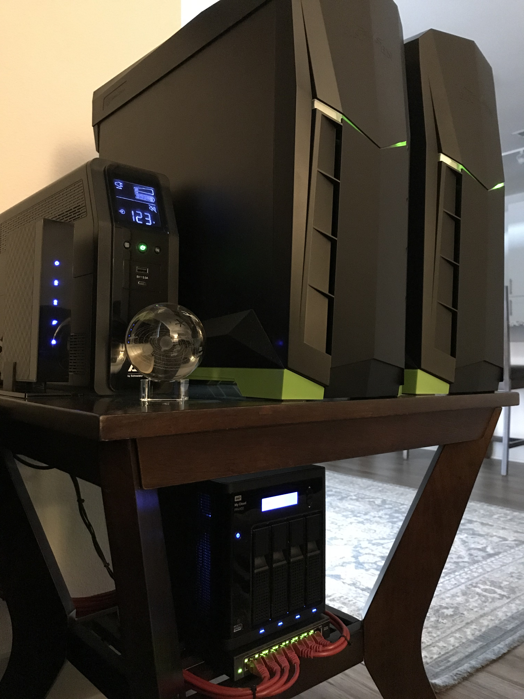
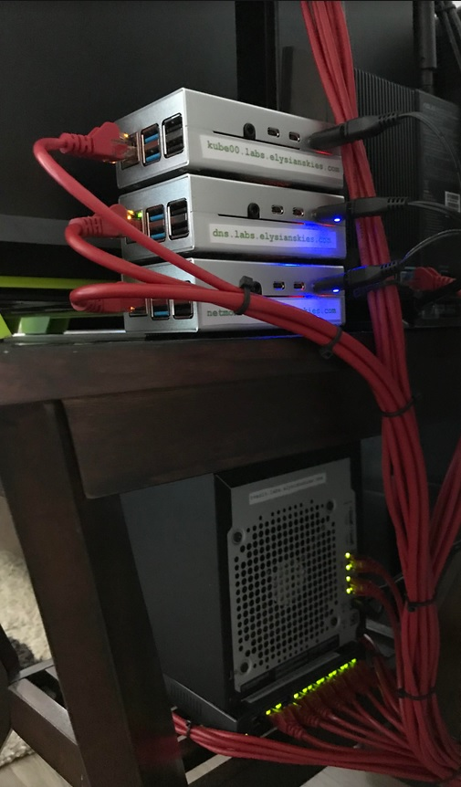

# elysian skies - home kubernetes cluster

  
*elysian skies lab*

| **maintainer_name**  | `Austin Ford`             |
|----------------------|---------------------------|
| **maintainer_email** | `j.austin.ford@gmail.com` |
| **public_domain**    | `labs.elysianskies.com`   |

 

[hardware](https://github.com/jaustinford/elise/blob/main/files/docs/hardware.md#hardware) 
[ingress](https://github.com/jaustinford/elise/blob/main/files/docs/hardware.md#ingress) 
[ethernet switching](https://github.com/jaustinford/elise/blob/main/files/docs/hardware.md#ethernet-switching) 
[battery and power](https://github.com/jaustinford/elise/blob/main/files/docs/hardware.md#battery-and-power)

 

### hardware
---

elysian skies is a 3-node kubernetes cluster comprising of :

1. `kube01.labs.elysianskies.com`
    - specs

        | model | custom                                      |
        |-------|---------------------------------------------|
        | cpu   | **Intel(R) Core(TM) i3-6100 CPU @ 3.70GHz** |
        | ram   | **32 GB**                                   |
        | os    | **Ubuntu 20.10**                            |
        | role  | **kubernetes worker node**                  |

    - storage

        | device     | size       | type | disk            |
        |------------|------------|------|-----------------|
        | `/dev/sda` | **240 GB** | ssd  | PNY CS900 240GB |

    - networking

        | interface  | description                                                                               | ipv4          | netmask         | gateway       | speed  |
        |------------|-------------------------------------------------------------------------------------------|---------------|-----------------|---------------|--------|
        | `bond0`    | round robin bond master for : `enp4s0`, `enp1s0f0`, `enp1s0f1`                            | `172.16.17.6` | `255.255.255.0` | `172.16.17.1` |        |
        | `enp4s0`   | Realtek Semiconductor Co., Ltd. RTL8111/8168/8411 PCI Express Gigabit Ethernet Controller |               |                 |               | 1 gbps |
        | `enp1s0f0` | Intel Corporation 82571EB/82571GB Gigabit Ethernet Controller                             |               |                 |               | 1 gbps |
        | `enp1s0f1` | Intel Corporation 82571EB/82571GB Gigabit Ethernet Controller                             |               |                 |               | 1 gbps |

2. `kube02.labs.elysianskies.com`
    - specs

        | model | custom                                      |
        |-------|---------------------------------------------|
        | cpu   | **Intel(R) Core(TM) i3-4370 CPU @ 3.80GHz** |
        | ram   | **32 GB**                                   |
        | os    | **Ubuntu 20.10**                            |
        | role  | **kubernetes worker node**                  |

    - storage

        | device     | size       | type | disk            |
        |------------|------------|------|-----------------|
        | `/dev/sda` | **240 GB** | ssd  | PNY CS900 240GB |

    - networking

        | interface  | description                                                                               | ipv4          | netmask         | gateway       | speed  |
        |------------|-------------------------------------------------------------------------------------------|---------------|-----------------|---------------|--------|
        | `bond0`    | round robin bond master for : `enp3s0`, `enp1s0f0`, `enp1s0f1`                            | `172.16.17.7` | `255.255.255.0` | `172.16.17.1` |        |
        | `enp3s0`   | Realtek Semiconductor Co., Ltd. RTL8111/8168/8411 PCI Express Gigabit Ethernet Controller |               |                 |               | 1 gbps |
        | `enp1s0f0` | Intel Corporation 82571EB/82571GB Gigabit Ethernet Controller                             |               |                 |               | 1 gbps |
        | `enp1s0f1` | Intel Corporation 82571EB/82571GB Gigabit Ethernet Controller                             |               |                 |               | 1 gbps |

3. `tvault.labs.elysianskies.com`
    - specs

        | model | **WD MyCloud PR4100**                         |
        |-------|-----------------------------------------------|
        | cpu   | **Intel(R) Pentium(R) CPU  N3710  @ 1.60GHz** |
        | ram   | **4 GB**                                      |
        | os    | **MyCloud**                                   |
        | role  | **nas**                                       |

    - storage

        | device     | size      | type  | disk           |
        |------------|-----------|-------|----------------|
        | `/dev/md1` | **12 TB** | raid5 |                |
        |            | **4 TB**  | ata   | WD Red Nas HDD |
        |            | **4 TB**  | ata   | WD Red Nas HDD |
        |            | **4 TB**  | ata   | WD Red Nas HDD |
        |            | **4 TB**  | ata   | WD Red Nas HDD |

    - networking

        | interface | description                                      | ipv4          | netmask         | gateway       | speed  |
        |-----------|--------------------------------------------------|---------------|-----------------|---------------|--------|
        | `bond0`   | round robin bond master for : `egiga0`, `egiga1` | `172.16.17.4` | `255.255.255.0` | `172.16.17.1` |        |
        | `egiga0`  |                                                  |               |                 |               | 1 gbps |
        | `egiga1`  |                                                  |               |                 |               | 1 gbps |
 
4. `kube00.labs.elysianskies.com`
    - specs

        | model | **Raspberry Pi 4 Model B Rev 1.4**    |
        |-------|---------------------------------------|
        | cpu   | **Cortex-A72**                        |
        | ram   | **8 GB**                              |
        | os    | **Ubuntu 20.10**                      |
        | role  | **kubernetes control plane, haproxy** |

    - storage

        | device           | size      | type        | disk        |
        |------------------|-----------|-------------|-------------|
        | `/dev/mmcblk0p2` | **32 GB** | **MicroSD** | **MicroSD** |

    - networking

        | interface | description                  | ipv4           | netmask         | gateway       | speed  |
        |-----------|------------------------------|----------------|-----------------|---------------|--------|
        | `eth0`    | `bcmgenet fd580000.ethernet` | `172.16.17.20` | `255.255.255.0` | `172.16.17.1` | 1 gbps |

5. `dns.labs.elysianskies.com`
    - specs

        | model | **Raspberry Pi 4 Model B Rev 1.4** |
        |-------|------------------------------------|
        | cpu   | **Cortex-A72**                     |
        | ram   | **8 GB**                           |
        | os    | **Ubuntu 20.10**                   |
        | role  | **pihole dns server**              |

    - storage

        | device           | size      | type        | disk        |
        |------------------|-----------|-------------|-------------|
        | `/dev/mmcblk0p2` | **16 GB** | **MicroSD** | **MicroSD** |

    - networking

        | interface | description                  | ipv4           | netmask         | gateway       | speed  |
        |-----------|------------------------------|----------------|-----------------|---------------|--------|
        | `eth0`    | `bcmgenet fd580000.ethernet` | `172.16.17.10` | `255.255.255.0` | `172.16.17.1` | 1 gbps |

6. `netmon.labs.elysianskies.com`
    - specs

        | model | **Raspberry Pi 4 Model B Rev 1.4** |
        |-------|------------------------------------|
        | cpu   | **Cortex-A72**                     |
        | ram   | **8 GB**                           |
        | os    | **Ubuntu 20.10**                   |
        | role  | **network monitoring and ids**     |

    - storage

        | device           | size      | type        | disk        |
        |------------------|-----------|-------------|-------------|
        | `/dev/mmcblk0p2` | **16 GB** | **MicroSD** | **MicroSD** |

    - networking

        | interface | description                  | ipv4           | netmask         | gateway       | speed  |
        |-----------|------------------------------|----------------|-----------------|---------------|--------|
        | `eth0`    | `bcmgenet fd580000.ethernet` | `172.16.17.19` | `255.255.255.0` | `172.16.17.1` | 1 gbps |

7. `manswitch01.labs.elysianskies.com`
    - specs

        | model | **Netgear GS108Ev3 - 8-Port Gigabit Ethernet Smart Managed Plus Switch** |
        |-------|--------------------------------------------------------------------------|
        | role  | **managed network switch**                                               |

    - networking

        | interface | description | ipv4           | netmask         | gateway       | speed  |
        |-----------|-------------|----------------|-----------------|---------------|--------|
        |           |             | `172.16.17.16` | `255.255.255.0` | `172.16.17.1` | 1 gbps |

8. `manswitch02.labs.elysianskies.com`
    - specs

        | model | **Netgear GS108Ev3 - 8-Port Gigabit Ethernet Smart Managed Plus Switch** |
        |-------|--------------------------------------------------------------------------|
        | role  | **managed network switch**    

    - networking

        | interface | description | ipv4           | netmask         | gateway       | speed  |
        |-----------|-------------|----------------|-----------------|---------------|--------|
        |           |             | `172.16.17.17` | `255.255.255.0` | `172.16.17.1` | 1 gbps |

9. `gw.labs.elysianskies.com`
    - specs

        | model | **ASUS RT-AC68U Wireless Router** |
        |-------|-----------------------------------|
        | ram   | **256 MB**                        |
        | role  | **wan router**                    |

    - networking

        | interface | description | ipv4          | netmask         | gateway | speed  |
        |-----------|-------------|---------------|-----------------|---------|--------|
        | **WAN**   |             |               |                 |         |        |
        | **LAN1**  |             | `172.16.17.1` | `255.255.255.0` |         | 1 gbps |
        | **LAN2**  |             |               |                 |         |        |
        | **LAN3**  |             |               |                 |         |        |
        | **LAN4**  |             |               |                 |         |        |

10. 10-port battery backup with surge protection
    - specs

        | model | **APC UPS 1500VA BR1500MS2** |
        |-------|------------------------------|
        | role  | **ups**                      |

11. cable modem
    - specs

        | model | **ASUS CM-16 DOCSIS 3.0** |
        |-------|---------------------------|
        | role  | **cable modem**           |

 

### ingress
---

> **NOTE** : load balancing `plexserver` is not supported in any general sense so this is really more like a hack but essentially it works like this: the value for `Custom certificate domain` in the plex web server config (Settings -> Network) MUST contain a value matching the CN for the certificate being used to terminate the incoming connection at the haproxy. That field is published to plex.tv which tells plex to trust any custom certificate signed for that domain. However it's intended for custom certificates that plex expects to be managing itself, not by an external load balancer. The load balancer is actually forwarding decrypted http to plex server which reports in the logs that plex consumers have insecure connections when really it's encrypted down to the haproxy. This is fine as long as it's encrypted over the public internet. The other way to load balance plex would be to use a simple tcp frontend in haproxy but that actually drops all the client source headers which contain the client IP data used in Tautulli's GeoIP component so it became necessary to find a strictly http-method load balance to preserve that data.

the only component to the kubernetes system not being managed by kubernetes is a standalone [`haproxy`](https://github.com/jaustinford/elise/blob/main/files/haproxy.cfg.sh) container, running on the same node as the kubernetes control plane, which handles all the inbound ingress and load balances across all the various kubernetes worker nodeports.

| haproxy frontend         | inbound port | proxy mode | lb method   | tls termination | description                                                           |
|--------------------------|--------------|------------|-------------|-----------------|-----------------------------------------------------------------------|
| acme                     | 80           | http       | round robin | no              | used for cerbot http method challenges in automating ssl cert renewal |
| nginx ingress controller | 443          | http       | round robin | yes             | main kubernetes ingress endpoint                                      |
| plexserver               | 32401        | http       | round robin | yes             | plex media server                                                     |
| squid                    | 3128         | tcp        | round robin | no              | squid proxy into the expressvpn tunnel                                |

 

### ethernet switching
---

lan managed switch ethernet port assignments
> **NOTE** from left to right facing switch will be port 0-7

> **NOTE** `manswitch03.labs.elysianskies.com` and office switch not pictured

| switch                              | port | host                                | interface  |
|-------------------------------------|------|-------------------------------------|------------|
| `manswitch01.labs.elysianskies.com` | 0    | `netmon.labs.elysianskies.com`      | `eth0`     |
|                                     | 1    | `gw.labs.elysianskies.com`          | `LAN1`     |
|                                     | 2    | `manswitch03.labs.elysianskies.com` |            |
|                                     | 3    | `manswitch02.labs.elysianskies.com` |            |
|                                     | 4    | `tvault.labs.elysianskies.com`      | `egiga0`   |
|                                     | 5    | `tvault.labs.elysianskies.com`      | `egiga1`   |
|                                     | 6    | `kube00.labs.elysianskies.com`      | `eth0`     |
|                                     | 7    | `dns.labs.elysianskies.com`         | `eth0`     |
| `manswitch02.labs.elysianskies.com` | 0    |                                     |            |
|                                     | 1    | `manswitch01.labs.elysianskies.com` |            |
|                                     | 2    | `kube02.labs.elysianskies.com`      | `enp1s0f1` |
|                                     | 3    | `kube02.labs.elysianskies.com`      | `enp1s0f0` |
|                                     | 4    | `kube02.labs.elysianskies.com`      | `enp3s0`   |
|                                     | 5    | `kube01.labs.elysianskies.com`      | `enp4s0`   |
|                                     | 6    | `kube01.labs.elysianskies.com`      | `enp1s0f0` |
|                                     | 7    | `kube01.labs.elysianskies.com`      | `enp1s0f1` |
| `manswitch03.labs.elysianskies.com` | 0    | `ps4.labs.elysianskies.com`         |            |
|                                     | 1    | `bedtv.labs.elysianskies.com`       |            |
|                                     | 2    | `dj.labs.elysianskies.com`          |            |
|                                     | 3    | `manswitch01.labs.elysianskies.com` |            |
|                                     | 4    | office switch                       |            |
|                                     | 5    |                                     |            |
|                                     | 6    |                                     |            |
|                                     | 7    | `watcher01.labs.elysianskies.com`   | `eth0`     |
| office switch                       | 0    | `watcher02.labs.elysianskies.com`   | `eth0`     |
|                                     | 1    | `charter.labs.elysianskies.com`     |            |
|                                     | 2    | `printer.labs.elysianskies.com`     |            |
|                                     | 3    | `eva.labs.elysianskies.com`         |            |
|                                     | 4    | `manswitch03.labs.elysianskies.com` |            |
| `gw.labs.elysianskies.com`          | 0    | `manswitch01.labs.elysianskies.com` |            |
|                                     | 1    |                                     |            |
|                                     | 2    |                                     |            |
|                                     | 3    |                                     |            |

 

### battery and power
---

ups power port assignments
> **NOTE** `*` denotes battery backup port

> **NOTE** facing back of ups

| * `manswitch02.labs.elysianskies.com` | * `tvault.labs.elysianskies.com` |
|---------------------------------------|----------------------------------|
| * `dns.labs.elysianskies.com`         | `netmon.labs.elysianskies.com`   |
| * `manswitch01.labs.elysianskies.com` | cable modem                      |
| * `kube00.labs.elysianskies.com`      | `gw.labs.elysianskies.com`       |
| * `kube01.labs.elysianskies.com`      | `kube02.labs.elysianskies.com`   |
